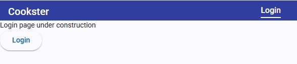
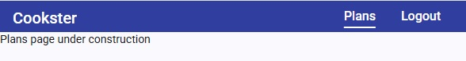
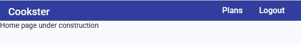

# Add Initial Skeleton Routes to Application

To get the ball rolling set up some skeleton routes that can be navigated through the application Navbar.

## Route Guards

At any particular time the application will be interacting with an authenticated user (logged in) or an unknown user (logged out). Some of the application's routes will need to be restricted to authenticated users only. Implement this by adding some guard functions to the _Authentication_ library.

### Modification to `authentication.ts`

Initially this service exposed a signal, _loggedIn_, that should have exposed the current authentication state of the user (true* or \_false*). Unfortunately a timing issue meant this approach was invalid so changed the service to expose an observable, _loggedIn\$_.

### _AuthGuard_

This guard function protects routes that should only be activated if the user is authenticated. Code is pretty simple:

```ts
export function authGuard(redirectUrl: string): CanActivateFn {
  return () => {
    const router = inject(Router);
    const auth = inject(AuthenticationService);
    return auth.loggedIn$.pipe(
      map((loggedIn) => {
        return loggedIn || router.parseUrl(redirectUrl);
      })
    );
  };
}
```

The guard function returns a mapping of the authentication _loggedIn$_ observable, emitting true if the value is true, or routing to an alternative path that can be accessed by an unauthenticated user. This path is provided in the route configuration (see below).

### _NotAuthGuard_

Very similar to the _AuthGuard_ function but this time exits true if the user is authenticated. Used to stop authenticated users going to routes that do not make sense, for example going to the login page if already logged in.

## Initial Routes

To get things started configured the following routes:

```ts
export const routes: Routes = [
  { path: '', redirectTo: '/login', pathMatch: 'full' },
  {
    path: 'login',
    loadComponent: () => import('@feature/login/index').then((m) => m.Login),
    canActivate: [notAuthGuard('/plans')],
  },
  {
    path: 'home',
    loadComponent: () => import('@feature/home/index').then((m) => m.Home),
  },
  {
    path: 'plans',
    loadComponent: () => import('@feature/plans/index').then((m) => m.Plans),
    canActivate: [authGuard('/login')],
  },
  { path: '**', loadComponent: () => import('@feature/page-not-found/index').then((m) => m.PageNotFound) },
];
```

To get this working needed to add skeleton libraries for _Login_, _Home_, _Plans_, and _PageNotFound_. The empty route redirects to "/login". If the user is authenticated then the _NotAuthGuard_ will redirect again to the "/plans" route. If the user is not authenticated the the _Login_ component is loaded. The rest of the routes are pretty self explanatory.

## Add Prototype Navbar

It's time to lose the dummy toolbar added when Angular Material was added to the project. Create a new component, _Navbar_, to the _app-container_ libary. This is where the application's navbar will be implemented.

If the application starts and the user is not authenticated then the application will route to the Login page and the Navbar will look as below.



The title is on the left side of the navbar and a link to the login page appears on the right side of the navbar. As the login page will be active when logged out the link is active and an underline below the Login legend indicates this situation.

The skeleton _Login_ component has a contruction message and a simple button that will perform a login operation with a test email address and password. Clicking this button authenticates the user and if authentication is successful routes to the Plans page (activates the _Plans_ component). The navbar will now look like:



We now see the "Plans" link in the navbar, underlined as it is the active link. The _Plans_ component is displayed below (construction message).

Final note, clicking the Cookster title will route the application to the Home page (realised by the _Home_ component). This route is available at all times.



The _Home_ component construction message is displayed and ad neither the Plans nor Logout links are active no underlines are displayed.

Note, clicking the Logout link will unauthenticate the user and re-route to the Login page.
