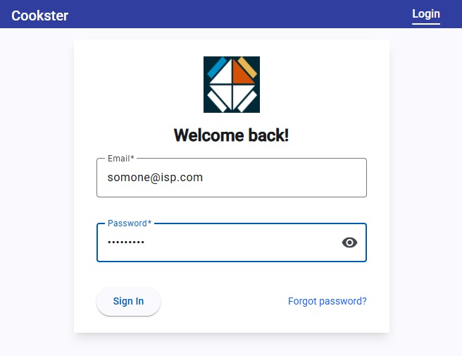
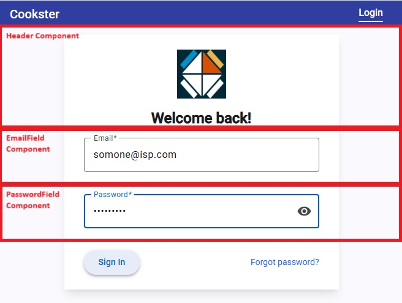

# Login Page

The Login page is activated when the user routes to `/login` and renders a form that can be filled by the user to sign in to the application. The image below shows the Login page.



The user enters their email address in the first field on the form and then the password below. When complete simply click the _Sign In_ button to authenticate and sign in. If successful the application will activate the `/plans` route.

The page is built from four components and a supporting service, _LoginService_.

```bat
Page component
 |
 |-- Header component
 |-- EmailField component
 |-- PasswordField component
```

The image below shows where the components are rendered on the page.


