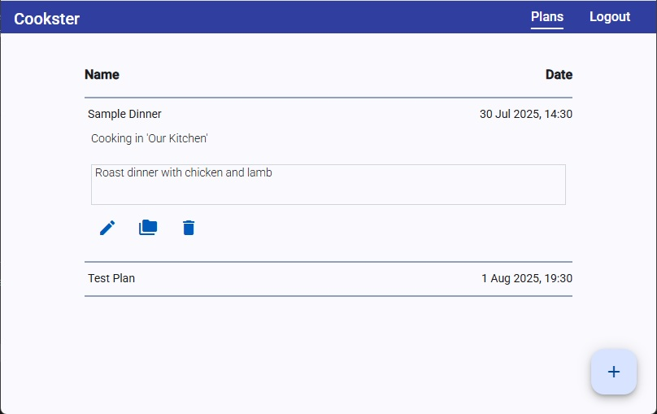

# Library: @feature/plans

The _@feature/plans_ library Displays a list of cooking plan summaries, one per cooking plan held in the Cookster database. The top level component in the library is the Plans component and it is this component that is activated by the `/plans` route. The following image is a screenshot of a typical plans page.

The page is a simple list of rows, each row containing the name of the cooking plan and the date/time when it ends. The user can expand a row to see more details for the plan by clicking the row. Only one plan can be expanded at a time so clicking an unexpanded row when another row is expanded will collapse that row and then expand the clicked row. Clicking an expanded row will collapse it again.

When expanded, as well as some additional details the row now contains three buttons that allow the user to:

- edit the plan
- copy the plan
- delete the plan

At present these buttons are not hooked up to any functionality, they simply log the fact they were clicked to the console.

The FAB button in the lower left of the viewport allows the user to add new plan. As with the plan action buttons in the expanded row view this button is not hooked up at present and simply logs a message to the console when clicked.
